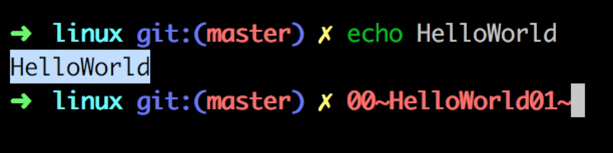

## 问题描述

粘贴内容到终端是两端出现莫名其妙的乱码字符，比如粘贴的内容是`HelloWorld`, 粘到终端为:

```
00~HelloWorld01~
```


在vim中以及其它编辑器都正常。

这是由于终端开启了[bracketed paste mode](http://cirw.in/blog/bracketed-paste),采用这种模式其中一个好处是程序可以很容易地判断输入是粘贴的还是手动输入的。

开启bracketed paste mode方法:

```sh
printf "\e[?2004h" # Enabled bracketed paste mode
```

关闭bracketed paste mode:

```sh
printf "\e[?2004l"
```

## 解决办法

如上，关闭bracketed paste mode即可。